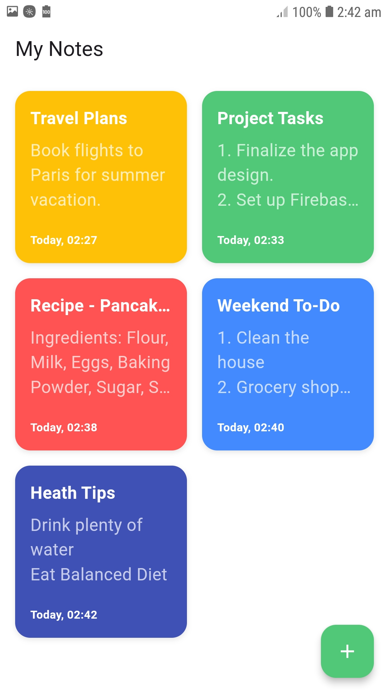
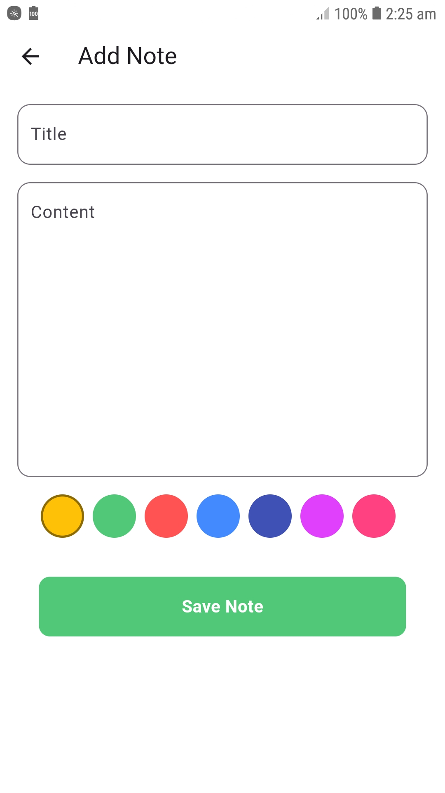
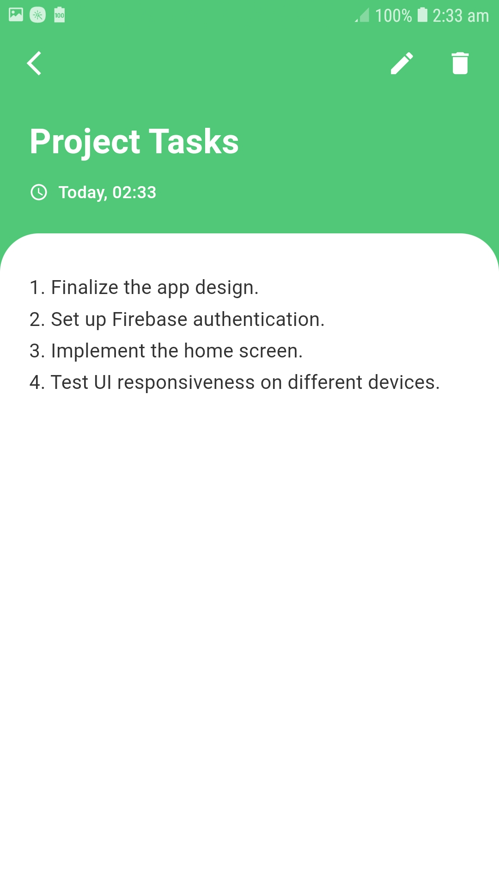
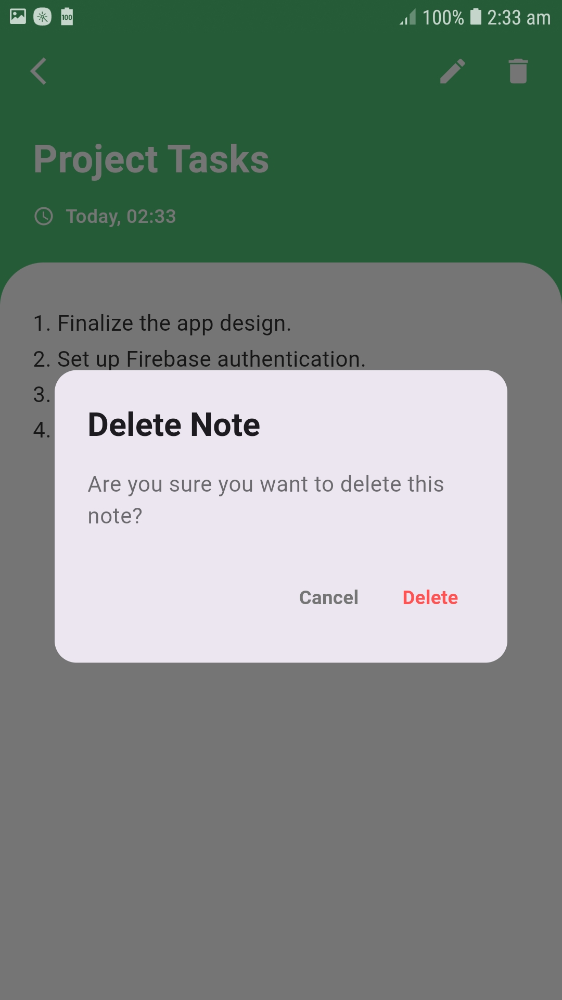
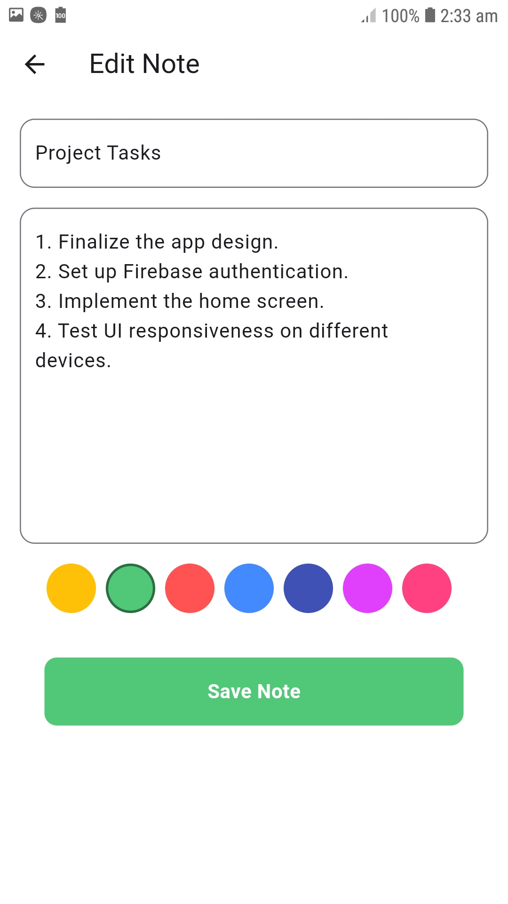

# MemoPad - Notes App

A simple Flutter application to manage notes with offline storage using SQLite. This app demonstrates the use of basic CRUD (Create, Read, Update, Delete) operations in a Flutter project.

## Features

- **Add Notes**: Create and store new notes in the app.
- **Edit Notes**: Update the content of existing notes.
- **Delete Notes**: Remove unwanted notes.
- **Offline Storage**: All notes are stored locally using SQLite, ensuring accessibility even without an internet connection.

## Screenshots

  <figure style="margin: 10px; text-align: center;">
    
    <figcaption>Home Page</figcaption>
  </figure>
  <figure style="margin: 10px; text-align: center;">
    
    <figcaption>Add Note</figcaption>
  </figure>
  <figure style="margin: 10px; text-align: center;">
    
    <figcaption>View Note</figcaption>
  </figure>
  <figure style="margin: 10px; text-align: center;">
    
    <figcaption>Delete Note</figcaption>
  </figure>
  <figure style="margin: 10px; text-align: center;">
    
    <figcaption>Edit Note</figcaption>
  </figure>

